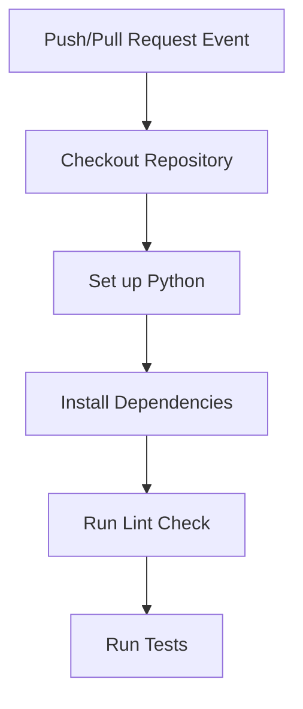
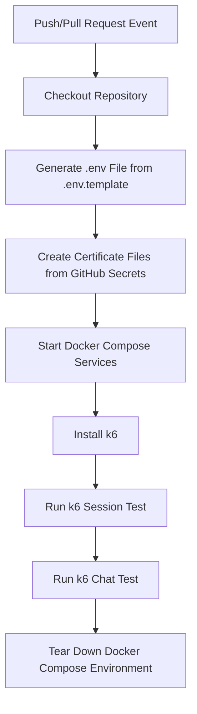

# CI/CD workflow

## 개요

- 이 CI/CD 워크플로우는 GitHub Actions를 사용하여 자동으로 환경 파일과 인증서 파일을 생성하고 Docker Compose 환경을 기동한 후 k6 부하 테스트를 실행하는 프로세스로 구성된다.
    - 이를 통해 코드 변경 시마다 전체 시스템의 통합 상태와 부하 테스트 결과를 자동으로 검증한다.

## 구성 요소

1. pytest
    1. 환경 구성: GitHub Actions에서 리포지토리를 체크아웃하고 설정된 matrix에 따라 OS, Python 버전 등을 조합하여 테스트 환경을 구성한다.
    2. 의존성 설치: requirements.txt 파일을 기반으로 필요한 패키지를 설치한다. 단, 캐시 기능을 사용하여 의존성 설치 시간을 단축한다.
    3. lint 검사: black을 사용하여 코드 스타일을 검사한다.
    4. 테스트 실행: pytest를 사용하여 테스트를 실행한다.
2. k6
    1. 환경 구성: GitHub Actions에서 리포지토리를 체크아웃하고 설정된 matrix에 따라 OS, Python 버전 등을 조합하여 테스트 환경을 구성한다.
    1. .env 파일 생성: .env.template 파일을 기반으로 GitHub Secrets의 값을 주입하여 .env 파일을 생성한다.
    2. 인증서 파일 생성: GitHub Secrets에 저장된 인증서 내용(PEM 형식)을 이용해 필요한 경로에 인증서 파일을 생성한다.
    3. Docker Compose 환경 기동: 생성된 .env 파일을 사용하여 Docker Compose 환경을 실행한다.
    4. k6 부하 테스트 실행: k6를 설치하고 준비된 Docker Compose 환경에서 k6를 사용하여 부하 테스트 스크립트를 실행한다.
    5. 환경 정리: 테스트 완료 후 Docker Compose 환경을 종료한다.

## Workflow 다이어그램

### pytest

- 설명
    1. Push/Pull Request Event: 코드 변경 시 이벤트 발생
    2. Checkout Repository: GitHub Actions에서 리포지토리 체크아웃
    3. Set up Python: 설정된 matrix에 따라 OS, Python 버전 등을 조합하여 테스트 환경을 구성
    4. Install Dependencies: requirements.txt 파일을 기반으로 필요한 패키지를 설치
    5. Run Lint Check: black을 사용하여 코드 스타일 검사
    6. Run Tests: pytest를 사용하여 테스트 실행

### k6

- 설명
    1. Push/Pull Request Event: 코드 변경 시 이벤트 발생
    2. Checkout Repository: GitHub Actions에서 리포지토리 체크아웃
    3. Generate .env File from .env.template: .env.template 파일을 기반으로 GitHub Secrets의 값을 주입하여 .env 파일 생성
    4. Create Certificate Files from GitHub Secrets: GitHub Secrets에 저장된 인증서 내용을 이용해 필요한 경로에 인증서 파일 생성
    5. Start Docker Compose Services: 생성된 .env 파일을 사용하여 Docker Compose 환경 실행
    6. Install k6: k6를 설치하여 부하 테스트 도구 준비
    7. Run k6 Session Test: k6를 사용하여 세션 부하 테스트 실행
    8. Run k6 Chat Test: k6를 사용하여 채팅 부하 테스트 실행
    9. Tear Down Docker Compose Environment: 테스트 완료 후 Docker Compose 환경 종료
