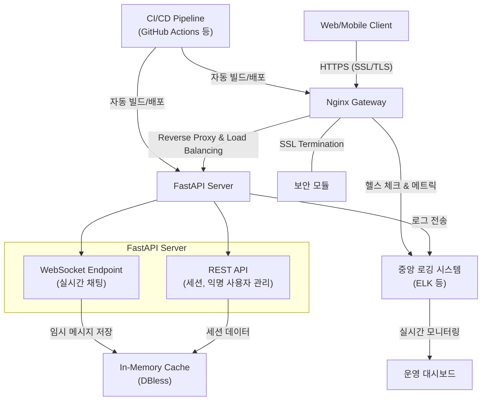

# cipher-chat

## 요구사항 분석

### 개요

#### 목표

1. 사용자 간 실시간 1:1 채팅 서비스를 제공하되 모든 대화 내용은 서버에 영구 저장하지 않고 익명성을 보장하여 개인정보 유출 위험을 최소화한다.
2. 높은 동시 접속자 수를 견딜 수 있도록 설계하며 제로 트러스트 보안 모델을 적용하여 모든 통신은 SSL/TLS로 암호화한다.

### 주요 기술 스택

1. 개발 프레임워크
    1. FastAPI: 비동기 Python 프레임워크, REST API 및 WebSocket 지원
    2. Python(3.12 이상): 가능한 안정적인 최신 Python 버전을 사용하여 비동기 기능 및 타입 힌트 활용
2. 네트워크 및 통신
    1. WebSocket 프로토콜: 실시간 양방향 통신 지원, 낮은 지연 시간 보장
    2. Nginx: 리버스 프록시, SSL 종료, 부하 분산 및 보안 강화
3. 컨테이너화 및 배포
    1. Docker: 컨테이너 기반 배포, 개발과 운영 환경의 일관성 보장
    2. docker-compose: 여러 컨테이너 서비스(FastAPI, Nginx 등)의 통합 관리 및 네트워크 구성
4. 테스트 도구
    1. pytest: 단위 테스트 및 통합 테스트 자동화
    2. Locust 또는 유사 부하 테스트 도구: 대규모 동시 접속 시나리오 테스트 및 성능 측정

### 요구사항

#### 기능 요구사항

1. 채팅 기능
    1. 실시간 1:1 채팅
        - 사용자 A와 사용자 B 간의 1:1 실시간 채팅 지원
        - 채팅 메시지는 서버에서 중계 후 일정 시간 내 혹은 즉시 메모리에서 삭제하는 DBless 설계를 적용
    2. 채팅 세션 관리
        - 채팅 세션 시작, 종료 및 재연결 처리
        - 사용자 연결/해제 이벤트를 실시간으로 처리
    3. 메시지 라우팅 및 전송
        - WebSocket 연결을 통한 실시간 메시지 전송
        - 클라이언트 간 직접적인 메시지 교환을 위한 라우팅 로직 구현
2. 익명성 보장 기능
    1. 익명 사용자 식별
        - 사용자 접속 시 서버에서 랜덤 UUID 기반 익명 ID 생성
        - 클라이언트에 최소한의 식별 정보만 제공하고 이를 통해 세션을 관리
    2. 대화 내용 비저장(DBless 설계)
        - 대화 데이터는 서버 메모리 또는 임시 캐시에서 관리
        - 메시지 전송 후 별도의 저장소에 기록하지 않고 일정 시간 이후 자동 삭제
3. 통신 및 연결 관리
    1. WebSocket 연결 관리
        - 지속적인 연결 유지를 위한 ping/pong(keep-alive) 메시지 처리
        - 연결 상태 모니터링 및 재연결 로직 구현
    2. REST API 엔드포인트
        - 채팅 세션 생성/종료, 익명 사용자 정보 관리 등 보조 기능 제공
        - 상태 체크 및 모니터링 API 제공
4. 보안 및 개인정보 보호
    1. 통신 보안(제로 트러스트 모델)
        - 모든 클라이언트-서버 간 통신에 대해 SSL/TLS 적용
        - Nginx를 활용하여 SSL 종료 후 내부 통신은 빠른 처리를 유지
    2. 네트워크 보안 강화
        - 리버스 프록시와 부하 분산을 통해 외부 공격 차단
        - WebSocket 연결 시 보안 헤더 및 인증 토큰 적용
    3. 접근 제어 및 인증
        - 네트워크 내부/외부 구분 없이 모든 요청에 대해 인증 및 권한 검증 수행
        - API/WebSocket 모두에 대해 최소 권한 원칙 적용

#### 비기능 요구사항

1. 성능 및 확장성
    1. 동시 접속자 처리
        - 수천~수만 명의 동시 접속자를 견딜 수 있는 비동기 I/O 기반 설계
        - 부하 분산과 연결 최적화를 통한 지연 시간 최소화
    2. 실시간 응답
        - 메시지 전송 지연 최소화
        - WebSocket 기반으로 실시간 상호작용 보장
2. 시스템 안정성 및 신뢰성
    1. 에러 핸들링 및 복구
        - 연결 장애, 네트워크 오류 등에 대한 자동 재연결 및 오류 처리 로직 구현
        - 서버 장애 시 컨테이너 기반의 빠른 복구 및 재배포 지원
    2. 모니터링 및 로깅
        - 각 컴포넌트(FastAPI, Nginx 컨테이너 등)의 상태 및 로그 모니터링
        - 문제 발생 시 신속한 디버깅을 위한 로깅 시스템 구축
3. 배포 및 유지보수
    1. 컨테이너화
        - Docker를 사용한 일관된 개발 및 운영 환경 보장
        - docker-compose를 통해 모든 서비스(FastAPI, Nginx 등)를 통합 관리
    2. CI/CD 파이프라인
        - 자동화된 테스트와 배포 스크립트를 통한 지속적인 통합 및 배포 체계 구축

## 시스템 아키텍처

### 개요

- FastAPI, Redis, Nginx를 포함하는 전체 시스템의 통합 구성, 보안 설정(TLS/SSL 적용), 부하 분산 및 E2E 테스트 결과를 정리한다.
    - 시스템은 제로 트러스트 모델을 적용하여 내부 네트워크까지 TLS로 보호하며 DBless 채팅 시스템으로 사용자 데이터를 영구 저장하지 않는다.

#### 목표

1. 사용자 간 실시간 1:1 채팅 서비스를 제공하면서 모든 대화 내용은 서버에 영구 저장하지 않고 익명성을 보장한다.
2. 높은 동시 접속자 수를 지원할 수 있도록 비동기 I/O와 부하 분산 전략을 적용하고 제로 트러스트 보안 모델에 따라 모든 통신을 SSL/TLS로 암호화한다.

#### 주요 특징

1. 실시간 채팅: WebSocket을 통한 양방향 통신으로 최소 지연의 1:1 채팅
2. 익명성 및 DBless 설계: 접속 시 UUID 기반 익명 사용자 식별, 메시지는 메모리에서 관리 및 일정 시간 후 삭제
3. 보안 강화: SSL/TLS 암호화, Nginx를 통한 리버스 프록시 및 부하 분산, 모든 요청에 대해 최소 권한 원칙 적용
4. 컨테이너화: Docker와 docker-compose를 활용해 개발부터 운영까지 일관된 환경 제공
5. 테스트 및 확장성: pytest, Locust 등 도구를 활용한 자동화 테스트 및 부하 테스트를 통한 안정성 확보

### 시스템 구성 요소

1. 클라이언트: 웹/모바일 애플리케이션
    - 사용자는 브라우저나 모바일 앱을 통해 채팅 서비스에 접속
    - 클라이언트는 WebSocket 프로토콜을 통해 서버와 지속적으로 연결
2. 게이트웨이(Nginx)
    - 역할
        - SSL 종료: 클라이언트로부터 받은 HTTPS 요청을 내부의 HTTP 통신으로 변환
        - 리버스 프록시: 외부 요청을 FastAPI 서버로 라우팅
        - 부하 분산: 다수의 FastAPI 인스턴스에 요청을 분산시켜 고부하 환경에 대응
    - 설정 포인트
        - SSL/TLS 설정 및 보안 헤더 적용
        - WebSocket 업그레이드 및 연결 유지 지원
3. 애플리케이션 서버(FastAPI)
    - 구성
        - REST API 엔드포인트: 채팅 세션 생성/종료, 익명 사용자 관리, 상태 체크 등 보조 기능 제공
        - WebSocket 엔드포인트: 실시간 메시지 전송 및 연결 유지, ping/pong 메시지를 통한 keep-alive 기능 구현
    - 주요 기능
        - 사용자 접속 시 UUID 기반 익명 식별자 발급
        - 채팅 메시지를 메모리 기반으로 관리하고 전송 후 또는 일정 시간 후 자동 삭제
        - 연결 상태 모니터링 및 재연결 로직 구현
4. 임시 데이터 관리(DBless 설계): 메모리 기반 관리
    - 서버의 RAM 혹은 임시 캐시를 사용하여 메시지와 세션 정보를 관리
    - 메시지는 전달 후 영구 저장 없이 일정 시간 후 자동 삭제하여 개인정보 유출 위험 최소화
5. 테스트 및 모니터링 도구
    - 테스트 도구
        - pytest를 통한 단위 및 통합 테스트
        - Locust 또는 유사 부하 테스트 도구로 대규모 동시 접속 시나리오 검증
    - 모니터링
        - 각 컨테이너(FastAPI, Nginx)의 로그 및 상태 모니터링을 위한 로그 집계 시스템 도입
        - 장애 발생 시 빠른 대응을 위한 에러 핸들링 로직 포함
6. 컨테이너 및 배포 환경
    - Docker: 각 구성 요소(FastAPI, Nginx 등)를 독립적인 컨테이너로 운영하여 환경 일관성 및 배포 자동화
    - docker-compose: 여러 컨테이너의 네트워크 구성, 환경 변수 설정, 의존성 관리를 통합 관리하여 로컬/CI/CD 환경 모두에 적용

### 상세 아키텍처 및 데이터 흐름

1. 클라이언트와 서버 간 연결 흐름
    1. 초기 접속
        1. 클라이언트는 HTTPS를 통해 Nginx에 접속
        2. Nginx는 SSL/TLS 암호화를 처리한 후 내부 네트워크로 요청을 전달
    2. 인증 및 익명화
        1. FastAPI 서버는 최초 접속 시 UUID 기반 익명 ID를 생성하여 클라이언트에 전달
        2. 이 ID를 통해 이후의 채팅 세션과 WebSocket 연결을 관리
    3. 실시간 채팅
        1. 클라이언트는 WebSocket 연결을 통해 FastAPI 서버와 실시간 메시지 교환을 시작
        2. 메시지는 서버의 메모리에서 임시로 관리되며 전송 직후 혹은 정해진 시간 이후 삭제
    4. 연결 유지 및 재연결
        1. FastAPI는 주기적인 ping/pong 메시지로 연결 상태를 확인하고 장애 발생 시 자동 재연결 로직을 실행
2. 내부 데이터 흐름 및 메시지 관리
    1. 메시지 라우팅
        1. 서버는 수신된 메시지를 해당 채팅 세션의 대상에게 즉시 중계
        2. 메시지는 전달 후 지속적으로 저장하지 않고 임시 메모리에서 삭제
    2. 세션 관리
        1. REST API를 통해 채팅 세션의 생성/종료 및 상태 확인 요청을 처리
        2. 익명 사용자 정보와 연결 정보는 세션 단위로 메모리에서 관리되며 세션 종료 시 모두 삭제

### 보안 및 네트워크 구성

1. SSL/TLS 암호화 및 제로 트러스트 보안
    1. SSL/TLS 적용
        - 모든 클라이언트-서버 간 통신은 SSL/TLS로 암호화되어 전송
        - Nginx에서 SSL 종료를 수행하여 외부와의 통신 보안을 유지하고 내부 통신은 빠른 처리와 함께 추가 보안 검증 수행
    2. 제로 트러스트 모델
        - 네트워크 내부/외부 구분 없이 모든 요청에 대해 인증 및 최소 권한 원칙을 적용
        - WebSocket 연결 시 보안 헤더와 인증 토큰을 포함하여 접근 제어를 강화
2. 네트워크 인프라 및 부하 분산
    1. Nginx 리버스 프록시
        - 클라이언트 요청을 FastAPI 서버로 전달하며 다수의 서버 인스턴스 간 부하를 분산
        - WebSocket 업그레이드 요청을 지원하여 지속적인 연결 유지에 문제없도록 설정
    2. 컨테이너 네트워킹
        - Docker Compose를 통해 FastAPI와 Nginx 컨테이너 간의 네트워크를 구성하고 각 컨테이너의 IP와 포트를 고정하여 안정적인 통신 경로를 유지

### 확장성, 모니터링 및 배포 전략

1. 확장성 설계
    1. 수평적 확장
        - FastAPI 서버를 여러 컨테이너로 배포하여 동시에 수천~수만 명의 접속자를 처리할 수 있도록 설계
        - Nginx의 부하 분산 기능을 활용해 트래픽을 여러 서버에 고르게 분배
    2. 비동기 I/O 활용
        - FastAPI의 비동기 기능을 극대화하여 각 연결의 I/O 작업을 효율적으로 처리
2. 모니터링 및 로깅
    1. 실시간 모니터링
        - FastAPI와 Nginx 컨테이너의 로그를 중앙집중식 로깅 시스템(예: ELK 스택)으로 집계하여 실시간 상태를 모니터링
        - 장애 발생 시 자동 알림 및 재시작 로직을 포함하여 시스템의 안정성을 향상
    2. 부하 테스트
        - Locust와 같은 부하 테스트 도구를 사용해 동시 접속자 수에 따른 성능 측정을 실시하고 병목 구간을 파악
        - pytest를 활용한 자동화 테스트 스크립트로 각 기능의 안정성을 검증
3. 배포 및 CI/CD 파이프라인
    1. 컨테이너 배포
        - Dockerfile과 docker-compose 파일을 통해 개발, 테스트, 운영 환경에서 동일한 컨테이너 이미지를 사용
        - CI/CD 도구(GitHub Actions, GitLab CI 등)를 활용해 자동 빌드, 테스트, 배포 과정을 구축
    2. 버전 관리 및 롤백
        - Git을 통한 버전 관리를 철저히 하고 문제가 발생할 경우 빠른 롤백이 가능하도록 배포 전략을 마련

### 아키텍처 다이어그램

1. 클라이언트
    -  Web/Mobile Client: 사용자는 HTTPS를 통해 Nginx 게이트웨이에 접속하며 SSL/TLS 암호화를 통해 안전한 통신을 보장
2. 게이트웨이(Nginx Gateway)
    - SSL 종료: 외부의 HTTPS 요청을 받아 내부 HTTP 요청으로 변환
    - 리버스 프록시 및 부하 분산: FastAPI 서버로 요청을 분산시켜 고부하 환경에서도 안정적인 서비스를 제공
    - 보안 모듈: SSL/TLS 적용 외에도 추가 보안 검증을 수행
3. 애플리케이션 서버(FastAPI Server)
    - REST API 엔드포인트: 채팅 세션 생성/종료, 익명 사용자 관리 등 보조 기능을 담당
    - WebSocket 엔드포인트: 실시간 1:1 채팅 기능을 구현하며 지속적인 연결 유지를 위해 ping/pong 메커니즘을 활용
4. DBless 설계: In-Memory Cache
    - 채팅 메시지와 세션 데이터는 임시로 메모리 캐시에 저장되며 전송 후 혹은 일정 시간이 지나면 자동 삭제되어 데이터 유출 위험을 최소화
5. 모니터링 및 로깅
    - FastAPI와 Nginx에서 발생하는 로그는 중앙 로깅 시스템(예: ELK 스택)으로 집계되며 운영 대시보드를 통해 실시간 모니터링
6. CI/CD Pipeline
    - GitHub Actions 등 CI/CD 도구를 사용해 자동 빌드 및 배포를 수행하여 개발부터 운영까지 일관된 환경을 유지

## 산출물 및 마일스톤

### 산출물

| 카테고리                  | 산출물                             | 세부 내용 및 설명                                                       |
|---------------------------|-----------------------------------|------------------------------------------------------------------------|
| **문서화 산출물**         | 요구사항 정의                      | 기능, 비기능, 보안 및 네트워크 요구사항 상세                               |
|                           | 시스템 아키텍처                    | 구성 요소, 데이터 흐름, 보안 정책, 네트워크 구성, 확장성 및 배포 전략       |
|                           | 설계 다이어그램                    | mermaid 다이어그램 (전체 시스템 아키텍처 및 데이터 흐름)                   |
|                           | 배포 및 CI/CD 전략                | Docker, docker-compose, CI/CD 파이프라인 구성 및 배포 전략                |
| **코드 및 구성 산출물**   | FastAPI 애플리케이션 코드          | REST API, WebSocket 엔드포인트, 익명 처리(UUID) 및 DBless 메시지 관리 로직 |
|                           | Nginx 구성 파일                   | SSL/TLS 설정, 리버스 프록시, 부하 분산 관련 구성 파일                      |
|                           | Dockerfile 및 docker-compose 파일 | 각 구성 요소의 컨테이너 빌드 및 네트워크 설정 파일                         |
|                           | 테스트 코드 및 스크립트            | pytest 단위/통합 테스트, Locust 등 부하 테스트 스크립트                    |
|                           | CI/CD 자동화 스크립트              | GitHub Actions, GitLab CI 등 자동 빌드/배포 스크립트                     |
| **테스트 및 운영 산출물** | 부하 테스트 보고서                 | 동시 접속 시나리오 및 성능 테스트 결과 보고서                              |
|                           | 모니터링 및 로깅 설정              | ELK 스택 등 모니터링 도구 설정 및 운영 대시보드 구성                       |
|                           | 최종 통합 테스트 보고서            | 전체 시스템 통합 테스트 결과 및 안정성 검증 문서                           |

---

### 마일스톤

| 단계                        | 기간     | 주요 산출물                                                                                         | 목표                                                                  |
|-----------------------------|---------|----------------------------------------------------------------------------------------------------|-----------------------------------------------------------------------|
| **초기 설계 단계**          | Day 1-2 | 요구사항 정의서, 시스템 아키텍처 문서, 설계 다이어그램 (mermaid 포함)                                   | 프로젝트 전반의 방향성 설정 및 구성 요소, 보안, 네트워크 요구사항 확립     |
| **개발 환경 세팅**          | Day 2   | Dockerfile, docker-compose, Git 초기화, 기본 폴더 구조                                               | 일관된 개발 환경 구축 및 초기 코드 베이스 마련                           |
| **기능 구현 단계**          | Day 3   | FastAPI REST API & WebSocket 엔드포인트 코드                                                         | 실시간 1:1 채팅 프로토타입 구현 및 기본 기능 테스트                      |
| **보안 설정**               | Day 4   | SSL 인증서 설정 및 Nginx 보안 구성 파일                                                               | 클라이언트-서버 통신 암호화 및 보안 강화                                 |
| **익명화 및 DBless 구현**   | Day 5   | UUID 기반 익명 사용자 식별 기능, in-memory 메시지 관리 로직, 테스트 코드                                | 사용자 익명성 보장 및 대화 데이터의 비저장 처리 구현                      |
| **네트워크 최적화**         | Day 6   | WebSocket 연결 관리 코드 (ping/pong, 재연결 로직)                                                     | 다수 동시 접속자 처리 및 안정적인 연결 유지 보장                         |
| **게이트웨이 및 부하 분산** | Day 7   | Nginx 구성 파일, 부하 분산 테스트 결과                                                                | 클라이언트 요청의 효율적 분산 및 서버 부하 관리                           |
| **통합 및 테스트 단계**     | Day 8-9 | 통합 docker-compose 파일, 서비스 간 연결 테스트 결과, 부하 테스트 스크립트 및 결과, CI/CD 자동화 스크립트 | 모든 구성 요소의 연동 및 전체 시스템 통합 검증, 성능 및 안정성 테스트      |
| **최종 검토 및 배포 단계**  | Day 10  | 최종 코드 리뷰 보고서, 배포 가이드 문서, 최종 통합 테스트 보고서, 최종 CI/CD 구성 파일                    | 모든 기능 및 보안 테스트 완료, 문서화된 가이드를 기반으로 안정적 배포 준비 |
