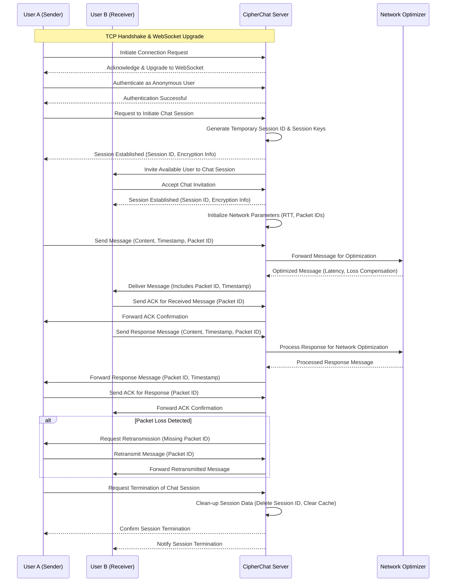

# cipher-chat

## 개요

CipherChat은 실시간 익명 1:1 채팅 서비스를 제공하는 애플리케이션을 목표로 ChatGPT를 활용하여 진행된 프로젝트입니다.

이 서비스는 다음과 같은 특징을 가지고 있습니다.

1. 실시간 통신
    - 사용자 간 즉각적인 메시지 송수신을 위해 빠른 응답 속도와 낮은 지연 시간을 보장합니다.
    - WebSocket을 기반으로 지속적인 양방향 통신을 구현합니다.
2. 익명성 보장
    - 사용자의 개인정보나 대화 내용이 서버에 영구적으로 저장되지 않도록 DBless 설계를 채택합니다.
    - 각 채팅 세션은 임시 식별자를 사용해 익명성을 유지합니다.
3. 네트워크 최적화
    - TCP/IP와 UDP를 심도 깊게 활용하여 채팅의 안정성과 속도를 동시에 만족시킵니다.
    - 소켓 통신, 비동기 I/O 처리, 멀티플렉싱 기법을 통해 대량의 동시 접속자를 효율적으로 처리합니다.
    - 패킷 손실, 재전송, 지연 보정 및 대역폭 최적화 기술을 적용해 네트워크 성능을 극대화합니다.
4. 컨테이너화 배포
    - Docker와 docker-compose를 활용하여 개발, 테스트 및 배포 환경을 일관되게 구성합니다.
    - 서비스의 확장성과 유지보수성을 높입니다.

## 목표

CipherChat 프로젝트의 목표는 구체적으로 다음과 같습니다.

1. 실시간 익명 채팅 구현
    - 목표: 사용자 간의 1:1 실시간 채팅 기능을 제공하며, 사용자가 접속하자마자 채팅이 시작될 수 있도록 합니다.
    - 세부 내용
        - WebSocket 기반의 실시간 통신 구현
        - 익명 사용자 식별 및 임시 세션 관리
2. 고성능 네트워크 통신
    - 목표: TCP/IP와 UDP의 특성을 모두 활용하여 빠른 응답과 낮은 지연 시간을 유지합니다.
    - 세부 내용
        - TCP 소켓 및 UDP 기반 통신 프로토콜 구현
        - 비동기 I/O, 멀티플렉싱 기법을 도입하여 다수의 연결을 효율적으로 처리
        - 패킷 손실, 재전송, 지연 보정 메커니즘 적용
3. 데이터 보안 및 익명성 강화
    - 목표: 사용자 대화 내용이 외부에 노출되지 않도록 서버 측에서 영구적으로 데이터를 저장하지 않는 구조를 만듭니다.
    - 세부 내용
        - DBless 설계로 대화 내용은 세션 종료 시 자동 삭제
        - 전송 데이터 암호화 및 임시 캐시 관리 방안 마련
4. 확장성과 신뢰성 확보
    - 목표: 많은 사용자가 동시에 접속하는 상황에서도 안정적인 서비스를 제공할 수 있도록 시스템을 설계합니다.
    - 세부 내용
        - Docker를 활용한 컨테이너 기반 배포로 환경 일관성 확보
        - 부하 테스트 및 성능 최적화를 위한 자동화된 테스트 스크립트 작성
        - 모듈 간 통합 및 성능 모니터링 시스템 구축
5. 개발 및 배포 자동화
    - 목표: 지속적인 통합 및 배포 환경을 마련하여 코드 변경 시 빠르고 안정적인 배포가 가능하도록 합니다.
    - 세부 내용
        - Docker-compose를 활용한 개발 환경 구성
        - 테스트 자동화 스크립트와 CI/CD 파이프라인 구축을 통해 반복 가능한 배포 프로세스 마련

## 요구사항

### 기능적 요구사항

1. 실시간 1:1 채팅
    - 세부 내용
        - 사용자는 익명으로 접속하여 다른 사용자와 1:1 채팅을 진행할 수 있어야 합니다.
        - WebSocket을 통해 지속적이고 양방향 통신을 지원합니다.
    - 핵심 포인트: 빠른 연결 수립, 낮은 지연 시간 보장, 메시지 송수신의 안정성
2. 익명화 및 DBless 설계
    - 세부 내용
        - 사용자의 실제 정보를 저장하지 않고 임시 세션 기반 또는 메모리/캐시 방식으로 대화 내용을 관리합니다.
        - 채팅 종료 시 대화 데이터는 자동 삭제됩니다.
    - 핵심 포인트: 개인정보 보호, 외부 공격 및 데이터 유출 방지
3. 네트워크 통신 및 최적화
    - 세부 내용
        - TCP/IP와 UDP를 기반으로 한 소켓 통신 구현
        - 비동기 I/O 처리 및 멀티플렉싱 기술 도입
        - 패킷 손실, 재전송, 지연(latency) 보정, 대역폭 최적화를 위한 메커니즘 구현
    - 핵심 포인트: 실시간 응답 및 낮은 지연 시간, 대규모 사용자 동시 접속 지원
4. Docker 기반 배포 및 컨테이너 관리
    - 세부 내용
        - Docker와 docker-compose를 활용해 환경을 컨테이너화
        - 여러 모듈(네트워크 통신, API 서버, 테스트 스크립트 등)을 독립적으로 관리 및 배포
    - 핵심 포인트: 이식성, 확장성, 운영 환경과의 일관성 유지
5. 테스트 코드 및 부하 테스트
    - 세부 내용
        - 유닛 테스트, 통합 테스트, 그리고 부하 테스트 스크립트 작성
        - 수많은 사용자가 동시에 접속하는 상황을 시뮬레이션할 수 있는 테스트 환경 구축
    - 핵심 포인트: 서비스 안정성 확보, 성능 병목 지점 사전 발견

### 비기능적 요구사항

1. 성능
    - 세부 내용
        - 낮은 응답 시간과 지연(latency) 최소화
        - 높은 동시 접속자 수를 지원할 수 있는 아키텍처
    - 핵심 포인트: 네트워크 최적화 기술 적용 및 효율적인 자원 관리
2. 보안
    - 세부 내용
        - 데이터 저장 없이 익명성 보장
        - 외부 침입 및 데이터 유출 위험 최소화
    - 핵심 포인트: 익명 채팅 특성에 맞는 보안 아키텍처 및 암호화 기법 고려
3. 확장성 및 유지보수성
    - 세부 내용
        - 모듈화된 아키텍처로 향후 기능 추가나 수정이 용이하게 설계
        - Docker 및 CI/CD 파이프라인 구축을 통한 지속적 통합 및 배포
    - 핵심 포인트: 장기적인 프로젝트 관리 및 확장에 유리한 구조
4. 신뢰성 및 가용성
    - 세부 내용
        - 네트워크 장애나 시스템 오류 발생 시 자동 복구 및 재시도 로직 구현
        - 장애 상황에 대비한 로깅 및 모니터링 시스템 구축
    - 핵심 포인트: 안정적 운영과 빠른 장애 대응

## 다이어그램

### Use Case 다이어그램

```mermaid
usecaseDiagram
    actor User as "User (Anonymous)"
    User --> (Connect to CipherChat)
    (Connect to CipherChat) --> (Establish WebSocket Connection)
    (Connect to CipherChat) --> (Authenticate Anonymously)

    User --> (Initiate Chat Session)
    (Initiate Chat Session) --> (Request Chat Partner)
    (Request Chat Partner) --> (Match with Available User)
    (Match with Available User) --> (Create Temporary Session)
    (Initiate Chat Session) --> (Exchange Session Keys)

    User --> (Exchange Messages)
    (Exchange Messages) --> (Send Message)
    (Exchange Messages) --> (Receive Message)
    (Exchange Messages) --> (Network Optimization)
    (Network Optimization) --> (Latency Measurement & Compensation)
    (Network Optimization) --> (Packet Loss Detection & Retransmission)
    (Network Optimization) --> (Multiplexing & Bandwidth Optimization)

    User --> (Terminate Chat Session)
    (Terminate Chat Session) --> (Close WebSocket Connection)
    (Terminate Chat Session) --> (Clean-up Session Data)
```

- 연결 및 인증: 사용자는 WebSocket 연결을 수립하고 별도의 인증 과정 없이 익명으로 접속합니다.
- 채팅 세션 시작: 사용자가 채팅을 요청하면 서버는 사용 가능한 다른 익명 사용자를 매칭하고 임시 세션(세션 ID, 암호화 키 교환)을 생성합니다.
- 메시지 송수신 및 네트워크 최적화: 채팅 중 사용자는 메시지를 주고받으며 서버는 네트워크 최적화(지연 측정, 패킷 손실 감지, 재전송, 멀티플렉싱 등)를 적용합니다.
- 채팅 종료: 사용자가 채팅 종료를 요청하면 서버는 연결을 종료하고 세션 데이터를 즉시 정리하여 익명성을 유지합니다.

### Sequence 다이어그램


```mermaid
sequenceDiagram
    participant UA as User A (Sender)
    participant UB as User B (Receiver)
    participant S as CipherChat Server
    participant N as Network Optimizer

    %% 연결 수립 및 인증
    Note over UA,S: TCP Handshake & WebSocket Upgrade
    UA->>S: Initiate Connection Request
    S-->>UA: Acknowledge & Upgrade to WebSocket
    UA->>S: Authenticate as Anonymous User
    S-->>UA: Authentication Successful

    %% 채팅 세션 초기화 및 매칭
    UA->>S: Request to Initiate Chat Session
    S->>S: Generate Temporary Session ID & Session Keys
    S-->>UA: Session Established (Session ID, Encryption Info)
    S->>UB: Invite Available User to Chat Session
    UB->>S: Accept Chat Invitation
    S-->>UB: Session Established (Session ID, Encryption Info)

    %% 네트워크 파라미터 설정
    S->>S: Initialize Network Parameters (RTT, Packet IDs)

    %% 메시지 송수신 - User A -> User B
    UA->>S: Send Message (Content, Timestamp, Packet ID)
    S->>N: Forward Message for Optimization
    N-->>S: Optimized Message (Latency, Loss Compensation)
    S->>UB: Deliver Message (Includes Packet ID, Timestamp)
    UB->>S: Send ACK for Received Message (Packet ID)
    S->>UA: Forward ACK Confirmation

    %% 메시지 송수신 - User B -> User A (응답)
    UB->>S: Send Response Message (Content, Timestamp, Packet ID)
    S->>N: Process Response for Network Optimization
    N-->>S: Processed Response Message
    S->>UA: Forward Response Message (Packet ID, Timestamp)
    UA->>S: Send ACK for Response (Packet ID)
    S->>UB: Forward ACK Confirmation

    %% 연결 유지 및 재전송 (필요 시)
    alt Packet Loss Detected
        S->>UA: Request Retransmission (Missing Packet ID)
        UA->>S: Retransmit Message (Packet ID)
        S->>UB: Forward Retransmitted Message
    end

    %% 채팅 종료
    UA->>S: Request Termination of Chat Session
    S->>S: Clean-up Session Data (Delete Session ID, Clear Cache)
    S-->>UA: Confirm Session Termination
    S-->>UB: Notify Session Termination
```

- 연결 수립 및 인증: 사용자 A가 서버에 접속 요청을 보내고 TCP 핸드셰이크를 통해 WebSocket으로 업그레이드한 후 익명 인증을 진행합니다.
- 채팅 세션 초기화 및 매칭: 서버는 임시 세션을 생성하고 사용 가능한 다른 익명 사용자(B)를 매칭하여 채팅 세션을 형성합니다. 이때 암호화 키 교환으로 메시지 보안을 강화합니다.
- 메시지 송수신
    - 전송: 사용자 A가 메시지를 보낼 때 메시지에는 타임스탬프와 고유의 패킷 ID가 포함됩니다. 서버는 네트워크 최적화 모듈(N)을 통해 지연 보정과 패킷 손실 보완을 수행한 후 사용자 B에게 전달합니다.
    - ACK 처리: 사용자 B는 메시지 수신 후 ACK를 전송하고 서버는 이를 사용자 A에게 전달합니다.
    - 재전송: 패킷 손실이 감지되면 서버는 재전송 요청을 통해 누락된 메시지를 다시 받습니다.
- 채팅 종료: 사용자가 채팅 종료를 요청하면 서버는 세션 데이터를 즉시 정리하고 양쪽 사용자에게 세션 종료를 통지하여 익명성과 데이터 비저장을 보장합니다.

## 아키텍처 설계

### 전체 시스탬 개요

- 클라이언트(Client)
    - 웹 또는 모바일 클라이언트가 WebSocket 혹은 소켓 통신을 통해 서버에 접속합니다.
- API 서버 (FastAPI 기반)
    - HTTP API 및 WebSocket 엔드포인트를 제공하며 실시간 채팅 연결을 관리합니다.
    - Uvicorn과 같은 ASGI 서버 위에서 실행됩니다.
- 네트워크 통신 모듈
    - TCP/UDP 소켓 레이어: 빠른 응답과 낮은 지연을 위해 TCP와 UDP를 혼합 사용합니다.
    - 비동기 I/O 처리: Python의 asyncio를 활용하여 다수의 연결을 효율적으로 처리합니다.
    - 멀티플렉싱 기법: select 혹은 epoll과 같은 기술을 도입해 다수의 소켓을 한 번에 관리합니다.
- 익명 및 DBless 채팅 세션 관리
    - 대화 내용은 서버 메모리나 임시 캐시(예: Redis의 비영구 모드)를 이용해 관리하며 세션 종료 시 자동 삭제됩니다.
- 네트워크 최적화 모듈
    - 패킷 손실 시 재전송, 지연 보정, 대역폭 최적화 등을 담당하는 모듈로 UDP 기반 빠른 전송과 TCP 기반 안정성을 동시에 보장합니다.
- 컨테이너화 (Docker)
    - 모든 서비스는 Docker 컨테이너 내에서 실행되어 배포와 확장성을 보장합니다.

### 아키텍처 구성도

```pgsql
           +-----------------+
           |    Client       |
           | (Web / Mobile)  |
           +--------+--------+
                    |
                    | WebSocket / Custom Socket (TCP/UDP)
                    |
           +--------v--------+
           |  FastAPI Server |      <---- API 엔드포인트, 인증(익명) 처리
           |   (Uvicorn)     |
           +--------+--------+
                    |
         +----------+-----------+
         |   Network Module     |
         | (TCP, UDP, Async I/O)|
         +----------+-----------+
                    |
         +----------+-----------+
         | Session Management   |
         | (In-Memory / Cache)  |
         +----------+-----------+
```

### 주요 모듈별 세부 설계

1. FastAPI 서버 및 WebSocket 엔드포인트
    - 기능
        - 클라이언트와의 실시간 연결을 설정 및 관리
        - API 요청 및 연결 상태를 관리하여 익명 사용자의 세션을 생성하고 관리합니다.
    - 구현 포인트
        - FastAPI의 WebSocket 지원을 활용하여 연결 요청 시 임시 토큰 혹은 UUID를 발급하여 익명성을 보장
        - HTTP 엔드포인트를 통해 초기 연결 설정, 연결 해제 등 관리
2. 네트워크 통신 모듈 (TCP/IP & UDP)
    - TCP 소켓
        - 신뢰성이 중요한 초기 연결 및 제어 메시지 전송에 사용
        - 연결 확립 후 안정적인 데이터 전달 보장
    - UDP 소켓
        - 빠른 전송과 낮은 지연이 필요한 채팅 메시지 전송에 사용
        - 별도의 ACK 기반 재전송 프로토콜을 적용해 패킷 손실 문제 해결
    - 비동기 I/O 및 멀티플렉싱
        - Python asyncio와 select/epoll을 활용하여 여러 소켓 연결을 동시에 모니터링
        - 각 클라이언트의 데이터를 비동기적으로 처리하여 지연 시간을 최소화
3. 익명 및 DBless 세션 관리
    - 세션 관리
        - 각 채팅 연결에 대해 서버 메모리 또는 임시 캐시를 사용하여 세션 정보를 저장
        - 대화 기록은 일정 시간 이후 자동 삭제되도록 설계
    - 보안 및 익명 처리
        - 서버에 영구적으로 데이터를 저장하지 않으므로 외부로부터의 접근 위험 최소화
        - 임시 토큰 또는 UUID를 통해 사용자를 식별하지만 이를 기반으로 개인 정보를 식별하지 않도록 함
4. 네트워크 최적화 모듈
    - 패킷 손실 및 재전송
        - UDP 전송 시 패킷 손실 발생에 대비하여 ACK 기반 재전송 로직을 구현
        - 재전송 간격과 횟수를 조정하여 네트워크 상황에 최적화
    - 지연(latency) 보정
        - 타임스탬프와 RTT 측정을 통해 네트워크 지연을 감지하고 보정하는 알고리즘 도입
    - 대역폭 최적화
        - 필요한 데이터만 전송하도록 패킷 크기 조절 및 중복 데이터 제거 로직 적용
5. Docker 기반 배포 및 관리
    - Dockerfile 및 docker-compose
        - FastAPI 애플리케이션, 네트워크 모듈, 테스트 스크립트 등이 하나 이상의 컨테이너로 배포
        - 각 컨테이너는 독립적으로 확장 가능하며 서비스 간의 의존성은 Docker 네트워크로 관리
    - CI/CD 파이프라인 연동
        - 코드 변경 시 자동 빌드, 테스트, 배포를 위한 스크립트 구성

#### 설계 시 고려할 점

- 확장성
    - 다수의 동시 접속 사용자를 지원하기 위해 비동기 처리 및 멀티플렉싱 기법을 적극 활용
    - Docker 기반으로 수평 확장이 용이한 구조 설계
- 보안
    - 데이터가 서버에 영구 저장되지 않도록 DBless 설계를 고수
    - 익명성과 데이터 무저장을 통한 개인정보 보호 강화
- 유지보수성
    - 각 모듈 간 인터페이스를 명확히 정의하여 나중에 기능 추가 및 수정 시 영향을 최소화
- 성능 최적화
    - 네트워크 레벨에서의 최적화(패킷 재전송, 지연 보정)를 통해 빠른 응답과 낮은 지연 시간 확보

## 기술 스택 및 도구 설정

1. 프로그래밍 언어 및 웹 프레임워크
    - Python 3.12+
        - 최신 비동기 프로그래밍 기능(async/await)을 충분히 활용할 수 있고 다양한 네트워크 프로그래밍 라이브러리와 호환성이 좋습니다.
    - FastAPI
        - 높은 성능과 비동기 I/O 지원 덕분에 실시간 채팅 서비스를 구현하는 데 적합합니다.
        - 자동 문서화, 데이터 유효성 검사(Pydantic) 등 개발 생산성을 높여주는 기능들이 내장되어 있습니다.
2. 서버 실행 및 비동기 네트워크 처리
    - Uvicorn
        - ASGI 서버로서 FastAPI와 완벽하게 호환되며 비동기 처리를 통해 낮은 지연 시간과 빠른 응답 속도를 제공합니다.
    - Asyncio 및 소켓 모듈
        - Python의 내장 asyncio 라이브러리와 소켓 모듈을 결합해 TCP/IP와 UDP 기반의 네트워크 통신을 비동기 방식으로 구현할 수 있습니다.
        - cf: UDP 통신에 특화된 라이브러리(예: aioudp)도 고려하여 패킷 손실, 재전송, 지연 보정 등 네트워크 최적화 기능을 구현할 수 있습니다.
    - 멀티플렉싱 기법 (select, epoll 등)
        - 대량의 동시 연결 처리를 위해 소켓의 상태를 효율적으로 감시하고 빠르게 I/O 이벤트를 처리할 수 있도록 도와줍니다.
3. 컨테이너화 및 배포 도구
    - Docker & Docker Compose
        - 컨테이너 기반의 환경 구성을 통해 개발, 테스트, 배포 간 일관된 환경을 유지할 수 있습니다.
        - 여러 서비스를 함께 운영할 때(예: 애플리케이션 서버, 임시 캐시 서버 등) docker-compose를 사용하면 설정과 관리가 용이해집니다.
4. 익명 처리 및 DBless 설계
    - 메모리 기반 임시 저장소
        - 데이터의 영구 저장 없이 채팅 세션 정보를 메모리나 캐시(예: Redis의 비영속 모드)로 관리합니다.
        - 익명성을 보장하고 대화 내용이 외부에 저장되지 않도록 하는 핵심 설계 원칙을 유지합니다.
5. 테스트 도구 및 부하 테스트
    - pytest
        - 단위 테스트와 통합 테스트를 작성하는 데 널리 사용되며 빠른 피드백을 통해 기능 검증을 할 수 있습니다.
    - 부하 테스트 도구 (Locust 또는 k6)
        - 다수의 사용자가 동시에 접속하는 상황을 시뮬레이션하여 시스템의 성능과 안정성을 미리 검증할 수 있습니다.
        - cf: 실제 네트워크 환경을 반영한 테스트 스크립트를 작성하여 패킷 손실, 지연 보정 등의 기능이 올바르게 작동하는지 확인합니다.
6. 코드 품질 관리 및 모니터링
    - 코드 스타일 및 정적 분석 도구 (Black, MyPy)
        - 일관된 코드 스타일과 정적 타입 검사를 통해 코드의 가독성과 유지보수성을 높입니다.
    - 로깅 및 모니터링
        - Python의 내장 logging 모듈 또는 추후 확장 시 Sentry, Grafana 같은 도구를 고려할 수 있습니다.
        - 운영 중 발생할 수 있는 문제를 빠르게 감지하고 대응할 수 있도록 로그를 체계적으로 관리합니다.


## 일정 및 마일스톤

| **일자**                | **주요 작업**                                                                                                                                                             | **산출물 및 목표**                                                                                                                                                                               |
|-------------------------|---------------------------------------------------------------------------------------------------------------------------------------------------------------------------|------------------------------------------------------------------------------------------------------------------------------------------------------------------------------------------------------------------------------|
| **Day 1: 기획 및 설계**  | - 프로젝트 개요 및 목표 설정<br>- 기능/비기능 요구사항 분석<br>- 시스템 아키텍처(흐름도, 구성도) 작성<br>- 기술 스택 및 도구 선정                                            | **산출물**<br>• 기획서 및 요구사항 문서<br>• 아키텍처 다이어그램<br>• 기술 스택 목록<br><br>**마일스톤:** 프로젝트 전반 계획 완료                                                             |
| **Day 2: 개발 환경 구성 및 기초 세팅** | - FastAPI 프로젝트 기본 구조 생성<br>- Docker 및 docker-compose 환경 구축<br>- 초기 의존성(uvicorn, asyncio 등) 설치                                                      | **산출물**<br>• Git 저장소에 초기 코드 베이스<br>• Dockerfile, docker-compose.yml<br><br>**마일스톤:** 개발 환경 및 기본 인프라 구축 완료                                                         |
| **Day 3: 네트워크 통신 기본 구현** | - TCP 소켓 서버/클라이언트 프로토타입 구현<br>- UDP 기반 빠른 응답 테스트<br>- 비동기 I/O(예: asyncio)를 통한 소켓 통신 개선                                                     | **산출물**<br>• 소켓 통신 프로토타입 코드<br><br>**마일스톤:** 기본 네트워크 통신 기능 동작 확인                                                                                  |
| **Day 4: FastAPI와 실시간 채팅 연동** | - FastAPI 내 WebSocket 엔드포인트 구현<br>- 익명 1:1 채팅 세션 관리 로직 작성<br>- 클라이언트 연결 및 해제 관리                                                               | **산출물**<br>• WebSocket 기반 채팅 프로토타입<br><br>**마일스톤:** 실시간 채팅 연결 기능 구현 완료                                                                               |
| **Day 5: 익명화 및 DBless 설계 구현** | - 대화 기록을 서버 메모리 또는 임시 캐시(예: volatile Redis)로 관리<br>- 채팅 세션 종료 시 자동 클린업 로직 구현                                                                    | **산출물**<br>• 익명 처리 및 임시 데이터 관리 모듈<br><br>**마일스톤:** 데이터 비저장 익명 채팅 기능 구현 완료                                                                          |
| **Day 6: 네트워크 최적화 기술 적용** | - 패킷 손실 시 재전송(ACK 기반) 로직 구현<br>- 지연(latency) 보정: 타임스탬프 및 RTT 측정 기능 도입<br>- 멀티플렉싱(select, epoll 등) 적용                                            | **산출물**<br>• 네트워크 최적화 코드<br>• 성능 측정 및 보정 스크립트<br><br>**마일스톤:** 네트워크 최적화 기능 적용 및 초기 성능 확인                                                               |
| **Day 7: 테스트 코드 및 부하 테스트 스크립트 작성** | - 단위 테스트, 통합 테스트 작성 (예: pytest 활용)<br>- 부하 테스트 스크립트 개발: 다수 사용자 동시 접속 시나리오 시뮬레이션<br>- Docker 내 테스트 자동화 환경 구성                        | **산출물**<br>• 테스트 스크립트 및 테스트 케이스<br>• 부하 테스트 실행 결과 보고서<br><br>**마일스톤:** 테스트 자동화 및 부하 테스트 환경 구축 완료                                                     |
| **Day 8: 통합 및 모듈 간 연동** | - 개별 모듈(네트워크, 채팅, 익명 처리 등) 통합<br>- 인터페이스 및 데이터 흐름 점검<br>- 통합 테스트 진행                                                                       | **산출물**<br>• 통합된 시스템 코드<br>• 통합 테스트 결과 보고서<br><br>**마일스톤:** 전체 시스템 통합 및 기능 검증 완료                                                                        |
| **Day 9: 디버깅 및 성능 최적화** | - 부하 테스트 결과 분석 및 코드 디버깅<br>- 로그/모니터링 시스템 구축<br>- 성능 개선을 위한 코드 리팩토링                                                                   | **산출물**<br>• 디버깅 및 최적화 보고서<br>• 개선된 코드 베이스<br><br>**마일스톤:** 안정성 확보 및 성능 최적화 완료                                                                               |
| **Day 10: 최종 점검, 문서화 및 배포 준비** | - 최종 기능 테스트 및 통합 검증<br>- 전체 시스템 문서화 (아키텍처, API 스펙, 테스트 및 배포 가이드)<br>- Docker 배포 스크립트 및 CI/CD 파이프라인 구성                                  | **산출물**<br>• 최종 문서 및 가이드<br>• 배포 스크립트, CI/CD 설정 파일<br><br>**마일스톤:** 최종 검증 완료 및 배포 준비 완료                                                                        |
