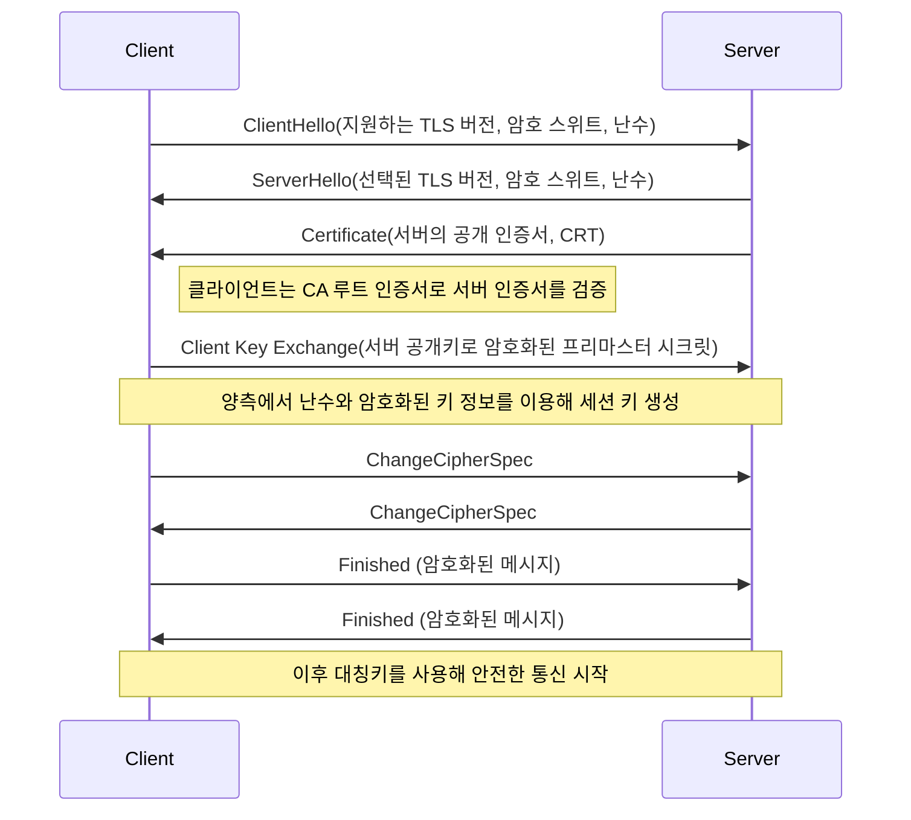
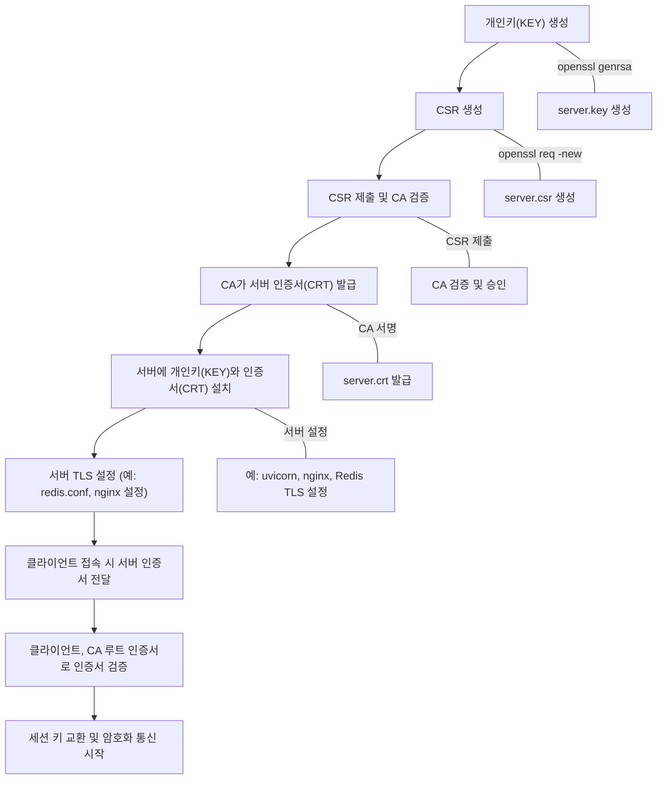

# certs

- 이 폴더에는 fastapi, redis, nginx에서 사용하는 CA 및 인증 파일들을 보관하고 있습니다.

## SSL/TLS

- 인터넷 상에서 데이터를 암호화하여 안전하게 전송하기 위한 프로토콜

### SSL/TLS의 작동 방식

- SSL/TLS 핸드쉐이크
    - 목적: 클라이언트와 서버가 서로를 인증하고 대칭키(세션 키)를 안전하게 교환하여 암호화 통신을 시작하는 과정
    - 핸드쉐이크 단계(개요)
        1. 클라이언트 헬로(ClientHello): 클라이언트가 지원하는 프로토콜 버전, 암호화 방식, 난수(Nonce) 등을 서버에 전송
        2. 서버 헬로(ServerHello): 서버가 선택한 프로토콜 버전, 암호화 방식, 난수 등을 클라이언트에 전달
        3. 서버 인증 및 키 교환
            - 서버는 자신의 인증서(CRT)를 클라이언트에 보내어 자신의 신원을 증명
            - 이 인증서는 CA(인증 기관)가 서명한 것으로 클라이언트는 CA의 공개 키(루트 인증서)를 사용해 인증서의 유효성을 검증
        4. 클라이언트 키 교환(Client Key Exchange): 클라이언트는 서버의 공개 키를 사용하여 대칭키(세션 키)를 암호화해서 서버에 전송
        5. 세션 키 생성: 양쪽 모두 이전 단계에서 교환한 난수와 암호화된 키 정보를 사용하여 동일한 대칭키(세션 키)를 생성
        6. 암호화 통신 시작: 이후 통신은 이 대칭키를 사용하여 암호화되어 전송

### SSL/TLS에서 사용되는 주요 용어

1. Private Key(KEY)
    - 정의
        - 개인키는 비대칭 암호화 방식에서 사용되는 비밀 키
        - 이 키는 소유자만 알고 있으며 암호화된 데이터의 복호화나 디지털 서명을 생성할 때 사용
    - 역할
        - CSR을 생성할 때 사용
        - 서버는 자신의 인증서에 대응하는 개인키를 안전하게 보관해야 함
2. Certificate Signing Request(CSR)
    - 정의
        - CSR은 인증서를 발급받기 위해 서버가 CA(인증 기관)에 보내는 요청 파일
        - CSR에는 서버의 공개키, 조직 정보, 도메인 이름 등 중요한 정보가 포함
    - 역할
        - 서버 관리자는 먼저 개인키를 생성한 후 이 개인키를 기반으로 CSR을 생성
        - CSR을 CA에 제출하면 CA가 해당 정보를 검증한 후 인증서를 발급
3. Public Certificate(CRT)
    - 정의
        - CRT 파일은 서버의 공개 인증서
        - 이 인증서에는 서버의 공개키와 서버 정보 그리고 CA가 서명한 디지털 서명이 포함
    - 역할
        - 클라이언트는 서버에 접속할 때 이 인증서를 받아서 CA의 공개키로 서명이 유효한지 검증
        - 인증서가 유효하면 클라이언트는 서버의 신뢰성을 확인
4. Certificate Authority(CA)
    - 정의
        - CA는 인증서를 발급하고 서명하는 신뢰할 수 있는 기관
        - CA는 자체 루트 인증서를 보유하며 이 루트 인증서를 클라이언트와 서버가 사전에 신뢰
    - 역할
        - 서버가 제출한 CSR을 검토하고 서버의 정보를 확인한 후 인증서를 발급
        - 클라이언트는 CA의 루트 인증서를 사용하여 서버 인증서(CRT)의 서명을 검증

### SSL/TLS의 적용 과정

1. 개인키(KEY) 생성
    - 서버 관리자는 먼저 개인키를 생성(`openssl genrsa -out server.key 2048`)
2. CSR 생성
    - 개인키를 사용하여 CSR을 생성(`openssl req -new -key server.key -out server.csr -subj "/CN=example.com"`)
    - 여기서 /CN=example.com은 서버의 도메인 이름
3. CSR 제출 및 인증서 발급
    - 서버 관리자는 CSR을 CA에 제출
    - CA가 정보를 확인한 후 서버의 공개키와 정보를 포함하는 인증서(CRT)를 발급하고 서명
    - 발급된 인증서를 서버에 설치
        - 단, CA의 루트 인증서(ca.crt)도 필요. 이는 클라이언트가 이 루트 인증서를 사용해 서버 인증서의 서명을 검증
4. 서버에 인증서와 개인키 적용
    - 서버(예: FastAPI, 웹 서버 등)는 개인키(server.key)와 인증서(server.crt)를 사용하여 TLS/SSL 연결을 설정
    - 클라이언트가 연결하면 서버는 인증서(server.crt)를 제공하여 자신의 신원을 증명
5. 클라이언트 인증
    - 클라이언트는 CA의 루트 인증서(ca.crt)를 사용해 서버 인증서의 서명이 유효한지 확인
    - 검증이 완료되면 클라이언트는 서버와 안전하게 암호화된 통신을 시작
